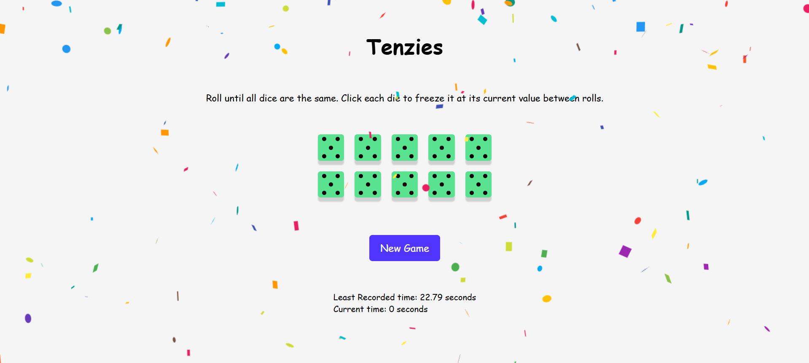

# Tenzies Game

## Overview
Tenzies is a fun and interactive dice game where the objective is to roll the dice until all of them show the same number. This project is built using React and JavaScript to create a smooth and engaging user experience.

## Features
- **Multiple Dice Rolls:** Players can roll the dice as many times as they need to match all dice to the same number.
- **Freeze Dice:** Players can "freeze" dice that match their desired number to avoid re-rolling them.
- **Game Timer:** Track how quickly you can match all dice!
- **Responsive Design:** Play on any device with a clean, mobile-friendly interface.

## Installation
To install and run this project locally, follow these steps:

1. Clone the repository:
    ```bash
    git clone https://github.com/prajit02/TenziesGame.git
    ```
2. Navigate to the project directory:
    ```bash
    cd TenziesGame
    ```
3. Install the dependencies:
    ```bash
    npm install
    ```

## Running the Game
To start the development server and play the game locally, run:
```bash
npm run dev
```
Open your browser and navigate to `http://localhost:5173` to see the game in action. This is the default port for Vite.

## Game Screenshot
Here’s what the game looks like after a victory:


## Contributing
Contributions are welcome! Please follow these steps to contribute:

1. Fork the repository.
2. Create a new branch (`git checkout -b feature/YourFeature`).
3. Commit your changes (`git commit -m 'Add some feature'`).
4. Push to the branch (`git push origin feature/YourFeature`).
5. Open a pull request.

## License
This project is licensed under the MIT License. See the [LICENSE](LICENSE) file for details.
